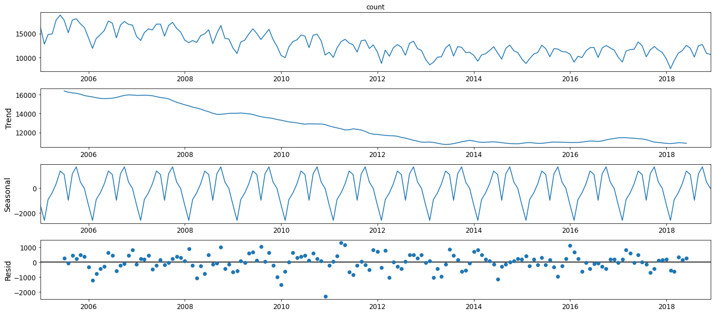
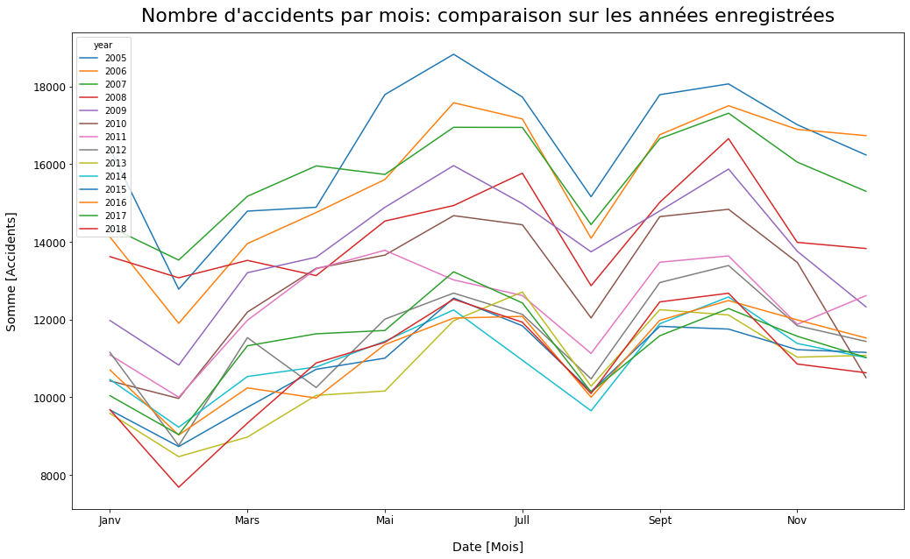

<hr style="margin-bottom: 20px;">

# Rapport sur l'accidentalité en france
#### Source: Ministère de l'intérieur sur data.gouv.fr
<hr style="margin-bottom: 20px;">


```python
## Librairies utilisées
import pandas as pd
import glob
from tabulate import tabulate
import numpy as np
from scipy.stats import chi2_contingency

# Prédiction avec arbres de décision 
from sklearn.tree import DecisionTreeClassifier # Import Decision Tree Classifier
from sklearn.model_selection import train_test_split # Import train_test_split function
from sklearn import metrics #Import scikit-learn metrics module for accuracy calculation
from sklearn.impute import SimpleImputer
from sklearn import tree
from graphviz import Source

from IPython.display import SVG


import matplotlib.pyplot as plt
import matplotlib
from pylab import rcParams
import statsmodels.api as sm
from statsmodels.tsa.stattools import adfuller
import matplotlib


# Graphe intéractif
import ipywidgets as widgets
from ipywidgets import interact, interact_manual
import cufflinks as cf

```

## Importer les données, jointures et nettoyage (Data preparation)

#### Lécture des fichiers


```python
# Fichiers caracteristiques
path_caracteristiques = r'C:\DataSources\caracteristiques' # path to Caracteristique files
all_files_caracteristiques = glob.glob(path_caracteristiques + "/*.csv") # Lister les fichiers contenus dans le path

li_caracteristiques = [] # Initialiser la lister de lécture

for filename in all_files_caracteristiques: # Boucler sur les fichiers en les lisant
    df = pd.read_csv(filename, index_col=None, header=0, encoding = "latin") # Bien spécifier encoding = "latin"
    li_caracteristiques.append(df)

frame_caracteristiques = pd.concat(li_caracteristiques, axis=0, ignore_index=True) # Créer un dataframe à partir de la liste des fichiers lus
nbr_lignes_cara = frame_caracteristiques['Num_Acc'].count()
print(f'\n======  {nbr_lignes_cara} lignes importées à partir des fichiers de caracteristiques  \n ')
print(tabulate(frame_caracteristiques.head(3), headers='keys', tablefmt='orgtbl'))


# Lecture lieux 
path_lieux = r'C:\DataSources\lieux' # path to Caracteristique files
all_files_lieux = glob.glob(path_lieux + "/*.csv")
li_lieux = []
for filename in all_files_lieux:
    df = pd.read_csv(filename, index_col=None, header=0, encoding = "latin", sep=',', low_memory=False)
    li_lieux.append(df)
frame_lieux = pd.concat(li_lieux, axis=0, ignore_index=True)
nbr_lignes_lieux = frame_lieux['Num_Acc'].count()
print(f'\n======  {nbr_lignes_lieux} lignes importées à partir des fichiers de lieux  \n ')
print(tabulate(frame_lieux.head(3), headers='keys', tablefmt='orgtbl'))

# Lecture usagers 
path_usagers = r'C:\DataSources\usagers' # path to Caracteristique files
all_files_usagers = glob.glob(path_usagers + "/*.csv")
li_usagers = []
for filename in all_files_usagers:
    df = pd.read_csv(filename, index_col=None, header=0, encoding = "latin", sep=',', low_memory=False)
    li_usagers.append(df)
frame_usagers = pd.concat(li_usagers, axis=0, ignore_index=True)
nbr_lignes_usagers = frame_usagers['Num_Acc'].count()
print(f'\n======  {nbr_lignes_usagers} lignes importées à partir des fichiers de usagers  \n ')
print(tabulate(frame_usagers.head(3), headers='keys', tablefmt='orgtbl'))
```

    
    ======  958469 lignes importées à partir des fichiers de caracteristiques  
     
    |    |      Num_Acc |   an |   mois |   jour |   hrmn |   lum |   agg |   int |   atm |   col |   com | adr              | gps   |         lat |   long |   dep |
    |----+--------------+------+--------+--------+--------+-------+-------+-------+-------+-------+-------+------------------+-------+-------------+--------+-------|
    |  0 | 201700000001 |   17 |      1 |     11 |   1820 |     5 |     2 |     1 |     1 |     1 |   477 | rue nationale    | M     | 5.05133e+06 | 292191 |   590 |
    |  1 | 201700000002 |   17 |      2 |     13 |   1630 |     1 |     2 |     3 |     1 |     3 |     5 | 5 rue sonneville | M     | 5.05361e+06 | 295314 |   590 |
    |  2 | 201700000003 |   17 |      3 |      7 |   1150 |     1 |     2 |     9 |     1 |     5 |    52 | rue Jules Guesde | M     | 5.05217e+06 | 288786 |   590 |
    
    ======  958469 lignes importées à partir des fichiers de lieux  
     
    |    |      Num_Acc |   catr |   voie |   v1 |   v2 |   circ |   nbv |   pr |   pr1 |   vosp |   prof |   plan |   lartpc |   larrout |   surf |   infra |   situ |   env1 |
    |----+--------------+--------+--------+------+------+--------+-------+------+-------+--------+--------+--------+----------+-----------+--------+---------+--------+--------|
    |  0 | 201700000001 |      3 |     39 |  nan |  nan |      2 |     2 |  nan |   nan |      2 |      1 |      1 |        0 |        70 |      1 |       0 |      1 |     99 |
    |  1 | 201700000002 |      3 |     39 |  nan |  nan |      2 |     2 |  nan |   nan |      0 |      1 |      0 |        6 |        10 |      1 |     nan |    nan |    nan |
    |  2 | 201700000003 |      3 |     39 |  nan |  nan |      2 |     2 |  nan |   nan |      0 |      1 |      0 |        0 |        10 |      1 |     nan |    nan |    nan |
    
    ======  2142195 lignes importées à partir des fichiers de usagers  
     
    |    |      Num_Acc |   place |   catu |   grav |   sexe |   trajet |   secu |   locp |   actp |   etatp |   an_nais | num_veh   |
    |----+--------------+---------+--------+--------+--------+----------+--------+--------+--------+---------+-----------+-----------|
    |  0 | 201700000001 |       1 |      1 |      3 |      1 |        9 |     13 |      0 |      0 |       0 |      1968 | B01       |
    |  1 | 201700000001 |       2 |      2 |      3 |      2 |        9 |     11 |      0 |      0 |       0 |      1973 | B01       |
    |  2 | 201700000001 |       1 |      1 |      3 |      1 |        1 |     13 |      0 |      0 |       0 |      1967 | A01       |
    

#### Jointure des fichiers


```python
# Première jointure entre caracteristiques et lieux sur le num accident. On ajoute le dataframe d'usagers par la suite

frame_accident = pd.merge(frame_caracteristiques, frame_lieux, on = 'Num_Acc')
df_acc_usr = pd.merge(frame_accident, frame_usagers, on = 'Num_Acc')
df_acc_usr['grav'] = df_acc_usr['grav'].map(lambda x: 1 if x == 2 else 0 )  # Accident morte = 1 autre accident = 0
print(f'======  Jointure des dataframe caracteristiques, lieux et usagers \n')

# Pour aller plus lopins, Il serait interessant d'ajouter le dataset relatif au vehicules
# Ajouter la cat de vehicule comme autre variable dans nos études

#print(tabulate(df_acc_usr.head(10), headers='keys', tablefmt='pretty'))

```

    ======  Jointure des dataframe caracteristiques, lieux et usagers 
    
    

#### Premier nettoyage des données

##### Mise en forme de la date


```python
# Mise en forme de la date
#### ¨pit avoir toutes les années tout format de quatre charactères. Ex: ( 5 -> 005 -> 05 -> 2005)  , (16 -> 0016, 16 -> 2016)
df_acc_usr['an01']  = ('00' + df_acc_usr['an'].map(str) )
df_acc_usr['an02']  = ('20' + df_acc_usr['an01'].str[-2:])

#### Pour avoir tout les mois sous format de deux charactères. Ex: ( 1 -> 001 -> 01) , (13 -> 0013 -> 13)
df_acc_usr['mois01']  = ('00' + df_acc_usr['mois'].map(str) ) 
df_acc_usr['mois02']  = ( df_acc_usr['mois01'].str[-2:] )

## Pour avoir tout les jours sous format de deux charactères. Ex: ( 3 -> 003 -> 03) , (15 -> 0015 -> 15)
df_acc_usr['jour01']  = ('00' + df_acc_usr['jour'].map(str) )
df_acc_usr['jour02']  = ( df_acc_usr['jour01'].str[-2:] )

## Pour avoir tout les jours sous format de quatre charactères. Ex: ( 3 -> 0003 -> 0003) , (1250 -> 0001250 -> 1250) , (230 -> 000230 -> 0230)
df_acc_usr['hrmn01']  = ('000' + df_acc_usr['hrmn'].map(str) )
df_acc_usr['hrmn02']  = ( df_acc_usr['hrmn01'].str[-4:] )

# Ajout de la colonne Date
df_acc_usr['Date'] =  df_acc_usr['an02'] + df_acc_usr['mois02'] + df_acc_usr['jour02'] + df_acc_usr['hrmn02']
# Changement du type de la colonne
df_acc_usr['Date'] = pd.to_datetime(df_acc_usr['Date'] , format='%Y%m%d%H%M')

print(f'======  Mise en forme des date effectué')
print(df_acc_usr['Date'].head(5))
```

    ======  Mise en forme des date effectué
    0   2017-01-11 18:20:00
    1   2017-01-11 18:20:00
    2   2017-01-11 18:20:00
    3   2017-02-13 16:30:00
    4   2017-02-13 16:30:00
    Name: Date, dtype: datetime64[ns]
    

##### Calculs des ages


```python
df_acc_usr['age'] = np.int64(df_acc_usr['an02']) - df_acc_usr['an_nais']
print(f'======  Calcul des ages effectué')
print(df_acc_usr['age'].head(5))
```

    ======  Calcul des ages effectué
    0    49.0
    1    44.0
    2    50.0
    3    64.0
    4    57.0
    Name: age, dtype: float64
    

##### Supression des colonnes non utilisées


```python
# Supression des colonnes inutiles
del df_acc_usr['an']
del df_acc_usr['an01']
del df_acc_usr['an02']
del df_acc_usr['mois']
del df_acc_usr['mois01']
del df_acc_usr['mois02']
del df_acc_usr['jour']
del df_acc_usr['jour01']
del df_acc_usr['jour02']
del df_acc_usr['hrmn']
del df_acc_usr['hrmn01']
del df_acc_usr['hrmn02']
del df_acc_usr['com']
del df_acc_usr['adr']
del df_acc_usr['gps']
del df_acc_usr['lat']
del df_acc_usr['long']
del df_acc_usr['dep']
del df_acc_usr['an_nais']
del df_acc_usr['num_veh']

print(f'======  Supression des colonnes inutilisées')
```

    ======  Supression des colonnes inutilisées
    

##### Changement des types de données


```python
df_acc_usr = df_acc_usr.astype({
    'lum': 'category', 'agg': 'category', 'int': 'category', 
    'atm': 'category', 'col': 'category', 'catr': 'category',
    'circ': 'category', 'vosp': 'category', 'prof': 'category',
    'plan': 'category', 'surf': 'category', 'infra': 'category', 
    'situ': 'category', 'env1': 'category', 'place': 'category', 
    'catu': 'category', 'grav': 'category', 'sexe': 'category', 
    'trajet': 'category', 'secu': 'category', 'locp': 'category', 
    'actp': 'category', 'etatp': 'category'
})
```

### Analyser la donnée (Data exploration)

#### Aperçu des données


```python
df_acc_usr.describe(percentiles=None, include='category')
```


<div>
<style scoped>
    .dataframe tbody tr th:only-of-type {
        vertical-align: middle;
    }

    .dataframe tbody tr th {
        vertical-align: top;
    }

    .dataframe thead th {
        text-align: right;
    }
</style>
<table border="1" class="dataframe">
  <thead>
    <tr style="text-align: right;">
      <th></th>
      <th>lum</th>
      <th>agg</th>
      <th>int</th>
      <th>atm</th>
      <th>col</th>
      <th>catr</th>
      <th>circ</th>
      <th>vosp</th>
      <th>prof</th>
      <th>plan</th>
      <th>...</th>
      <th>env1</th>
      <th>place</th>
      <th>catu</th>
      <th>grav</th>
      <th>sexe</th>
      <th>trajet</th>
      <th>secu</th>
      <th>locp</th>
      <th>actp</th>
      <th>etatp</th>
    </tr>
  </thead>
  <tbody>
    <tr>
      <th>count</th>
      <td>2142195</td>
      <td>2142195</td>
      <td>2142195</td>
      <td>2142046.0</td>
      <td>2142152.0</td>
      <td>2142193.0</td>
      <td>2138626.0</td>
      <td>2135842.0</td>
      <td>2137752.0</td>
      <td>2136789.0</td>
      <td>...</td>
      <td>2129477.0</td>
      <td>2019067.0</td>
      <td>2142195</td>
      <td>2142195</td>
      <td>2142195</td>
      <td>2141701.0</td>
      <td>2085658.0</td>
      <td>2085834.0</td>
      <td>2085733.0</td>
      <td>2085777.0</td>
    </tr>
    <tr>
      <th>unique</th>
      <td>5</td>
      <td>2</td>
      <td>10</td>
      <td>9.0</td>
      <td>7.0</td>
      <td>8.0</td>
      <td>5.0</td>
      <td>4.0</td>
      <td>5.0</td>
      <td>5.0</td>
      <td>...</td>
      <td>3.0</td>
      <td>10.0</td>
      <td>4</td>
      <td>2</td>
      <td>2</td>
      <td>7.0</td>
      <td>24.0</td>
      <td>9.0</td>
      <td>8.0</td>
      <td>4.0</td>
    </tr>
    <tr>
      <th>top</th>
      <td>1</td>
      <td>2</td>
      <td>1</td>
      <td>1.0</td>
      <td>3.0</td>
      <td>4.0</td>
      <td>2.0</td>
      <td>0.0</td>
      <td>1.0</td>
      <td>1.0</td>
      <td>...</td>
      <td>0.0</td>
      <td>1.0</td>
      <td>1</td>
      <td>0</td>
      <td>1</td>
      <td>5.0</td>
      <td>11.0</td>
      <td>0.0</td>
      <td>0.0</td>
      <td>0.0</td>
    </tr>
    <tr>
      <th>freq</th>
      <td>1476913</td>
      <td>1409485</td>
      <td>1508764</td>
      <td>1731553.0</td>
      <td>646254.0</td>
      <td>1020816.0</td>
      <td>1348599.0</td>
      <td>2004172.0</td>
      <td>1630969.0</td>
      <td>1653317.0</td>
      <td>...</td>
      <td>1210476.0</td>
      <td>1596108.0</td>
      <td>1594260</td>
      <td>2084614</td>
      <td>1439318</td>
      <td>796393.0</td>
      <td>1197467.0</td>
      <td>1923108.0</td>
      <td>1913376.0</td>
      <td>1914793.0</td>
    </tr>
  </tbody>
</table>
<p>4 rows × 23 columns</p>
</div>


```python
df_acc_usr.describe(percentiles=None, exclude=['category', 'datetime'])
```


<div>
<style scoped>
    .dataframe tbody tr th:only-of-type {
        vertical-align: middle;
    }

    .dataframe tbody tr th {
        vertical-align: top;
    }

    .dataframe thead th {
        text-align: right;
    }
</style>
<table border="1" class="dataframe">
  <thead>
    <tr style="text-align: right;">
      <th></th>
      <th>Num_Acc</th>
      <th>voie</th>
      <th>v1</th>
      <th>v2</th>
      <th>nbv</th>
      <th>pr</th>
      <th>pr1</th>
      <th>lartpc</th>
      <th>larrout</th>
      <th>age</th>
    </tr>
  </thead>
  <tbody>
    <tr>
      <th>count</th>
      <td>2.142195e+06</td>
      <td>1955131.0</td>
      <td>750230.000000</td>
      <td>91634</td>
      <td>2.135950e+06</td>
      <td>1.121537e+06</td>
      <td>1.117644e+06</td>
      <td>2.014575e+06</td>
      <td>2.018811e+06</td>
      <td>2.139777e+06</td>
    </tr>
    <tr>
      <th>unique</th>
      <td>NaN</td>
      <td>2721.0</td>
      <td>NaN</td>
      <td>57</td>
      <td>NaN</td>
      <td>NaN</td>
      <td>NaN</td>
      <td>NaN</td>
      <td>NaN</td>
      <td>NaN</td>
    </tr>
    <tr>
      <th>top</th>
      <td>NaN</td>
      <td>0.0</td>
      <td>NaN</td>
      <td>A</td>
      <td>NaN</td>
      <td>NaN</td>
      <td>NaN</td>
      <td>NaN</td>
      <td>NaN</td>
      <td>NaN</td>
    </tr>
    <tr>
      <th>freq</th>
      <td>NaN</td>
      <td>925956.0</td>
      <td>NaN</td>
      <td>50670</td>
      <td>NaN</td>
      <td>NaN</td>
      <td>NaN</td>
      <td>NaN</td>
      <td>NaN</td>
      <td>NaN</td>
    </tr>
    <tr>
      <th>mean</th>
      <td>2.010923e+11</td>
      <td>NaN</td>
      <td>0.079216</td>
      <td>NaN</td>
      <td>2.107546e+00</td>
      <td>9.236276e+01</td>
      <td>2.899833e+02</td>
      <td>5.575486e+00</td>
      <td>5.985202e+01</td>
      <td>3.748199e+01</td>
    </tr>
    <tr>
      <th>std</th>
      <td>4.081452e+08</td>
      <td>NaN</td>
      <td>0.608558</td>
      <td>NaN</td>
      <td>1.528709e+00</td>
      <td>4.428746e+02</td>
      <td>3.586551e+02</td>
      <td>2.332773e+01</td>
      <td>6.585246e+01</td>
      <td>1.826791e+01</td>
    </tr>
    <tr>
      <th>min</th>
      <td>2.005000e+11</td>
      <td>NaN</td>
      <td>0.000000</td>
      <td>NaN</td>
      <td>0.000000e+00</td>
      <td>0.000000e+00</td>
      <td>0.000000e+00</td>
      <td>0.000000e+00</td>
      <td>-8.100000e+01</td>
      <td>0.000000e+00</td>
    </tr>
    <tr>
      <th>25%</th>
      <td>2.007001e+11</td>
      <td>NaN</td>
      <td>0.000000</td>
      <td>NaN</td>
      <td>2.000000e+00</td>
      <td>0.000000e+00</td>
      <td>0.000000e+00</td>
      <td>0.000000e+00</td>
      <td>0.000000e+00</td>
      <td>2.300000e+01</td>
    </tr>
    <tr>
      <th>50%</th>
      <td>2.011000e+11</td>
      <td>NaN</td>
      <td>0.000000</td>
      <td>NaN</td>
      <td>2.000000e+00</td>
      <td>7.000000e+00</td>
      <td>1.450000e+02</td>
      <td>0.000000e+00</td>
      <td>6.000000e+01</td>
      <td>3.400000e+01</td>
    </tr>
    <tr>
      <th>75%</th>
      <td>2.014001e+11</td>
      <td>NaN</td>
      <td>0.000000</td>
      <td>NaN</td>
      <td>2.000000e+00</td>
      <td>3.000000e+01</td>
      <td>5.000000e+02</td>
      <td>0.000000e+00</td>
      <td>8.000000e+01</td>
      <td>5.000000e+01</td>
    </tr>
    <tr>
      <th>max</th>
      <td>2.018001e+11</td>
      <td>NaN</td>
      <td>9.000000</td>
      <td>NaN</td>
      <td>9.900000e+01</td>
      <td>9.929000e+03</td>
      <td>9.540000e+03</td>
      <td>9.600000e+02</td>
      <td>9.990000e+02</td>
      <td>1.090000e+02</td>
    </tr>
  </tbody>
</table>
</div>


#### Verifier le taux de valeurs manquantes


```python
df_missing_values = pd.DataFrame(df_acc_usr.isnull().sum())[0]
df_missing_values = pd.DataFrame({'colonne':df_missing_values.index, 'nbr_manquant':df_missing_values.values})
nbr_lignes = df_acc_usr['Num_Acc'].count()
df_missing_values["%_missing"] = ((df_missing_values['nbr_manquant'] / nbr_lignes )* 100 ).round(decimals=2)
print(f'======  Valeurs nul dans les données \n')
print(tabulate(pd.DataFrame(df_missing_values), headers='keys', tablefmt='pretty', showindex=False))
```

    ======  Valeurs nul dans les données 
    
    +---------+--------------+-----------+
    | colonne | nbr_manquant | %_missing |
    +---------+--------------+-----------+
    | Num_Acc |      0       |    0.0    |
    |   lum   |      0       |    0.0    |
    |   agg   |      0       |    0.0    |
    |   int   |      0       |    0.0    |
    |   atm   |     149      |   0.01    |
    |   col   |      43      |    0.0    |
    |  catr   |      2       |    0.0    |
    |  voie   |    187064    |   8.73    |
    |   v1    |   1391965    |   64.98   |
    |   v2    |   2050561    |   95.72   |
    |  circ   |     3569     |   0.17    |
    |   nbv   |     6245     |   0.29    |
    |   pr    |   1020658    |   47.65   |
    |   pr1   |   1024551    |   47.83   |
    |  vosp   |     6353     |    0.3    |
    |  prof   |     4443     |   0.21    |
    |  plan   |     5406     |   0.25    |
    | lartpc  |    127620    |   5.96    |
    | larrout |    123384    |   5.76    |
    |  surf   |     4407     |   0.21    |
    |  infra  |    12600     |   0.59    |
    |  situ   |    11607     |   0.54    |
    |  env1   |    12718     |   0.59    |
    |  place  |    123128    |   5.75    |
    |  catu   |      0       |    0.0    |
    |  grav   |      0       |    0.0    |
    |  sexe   |      0       |    0.0    |
    | trajet  |     494      |   0.02    |
    |  secu   |    56537     |   2.64    |
    |  locp   |    56361     |   2.63    |
    |  actp   |    56462     |   2.64    |
    |  etatp  |    56418     |   2.63    |
    |  Date   |      0       |    0.0    |
    |   age   |     2418     |   0.11    |
    +---------+--------------+-----------+
    

#### Supression des colonnes inutilisées


```python
del df_acc_usr['v1']
del df_acc_usr['v2']
del df_acc_usr['pr']
del df_acc_usr['pr1']
del df_acc_usr['voie']
del df_acc_usr['larrout']
del df_acc_usr['lartpc']
del df_acc_usr['nbv']
del df_acc_usr['locp']
del df_acc_usr['secu']
del df_acc_usr['actp']
del df_acc_usr['etatp']
```

#### Imputation des valeurs manquantes


```python
# Remplacer les valeurs manquantes de l'age par la moyenne
df_acc_usr['age'].fillna(df_acc_usr['age'].mean(), inplace=True)


# Je n'ai pas pu remplacer les valeurs manquantes des attribtuts quali de la même façon à cause d'un bug panda https://github.com/pandas-dev/pandas/issues/35731
# J'ai utilisé l'imputer de sklearner à la place
imp = SimpleImputer(strategy='most_frequent')
imputed_df_acc_usr = imp.fit_transform(df_acc_usr)

# De l'imputation résulte un numpy_darray, il faudra le transformer en dataframe pour continuer les analyses
imputed_df_acc_usr = pd.DataFrame(imputed_df_acc_usr, columns=['Num_Acc', 'lum', 'agg', 'int', 'atm', 'col', 'catr', 'circ', 'vosp',
                                                       'prof', 'plan', 'surf', 'infra', 'situ', 'env1', 'place', 'catu',
                                                       'grav', 'sexe', 'trajet', 'Date', 'age'])

# Verifier que toutes les valeurs manquantes ont été remplacées
df_missing_values = pd.DataFrame(imputed_df_acc_usr.isnull().sum())[0]
df_missing_values = pd.DataFrame({'colonne':df_missing_values.index, 'nbr_manquant':df_missing_values.values})
nbr_lignes = df_acc_usr['Num_Acc'].count()
df_missing_values["%_missing"] = ((df_missing_values['nbr_manquant'] / nbr_lignes )* 100 ).round(decimals=2)
print(tabulate(pd.DataFrame(df_missing_values), headers='keys', tablefmt='pretty', showindex=False))
```

    +---------+--------------+-----------+
    | colonne | nbr_manquant | %_missing |
    +---------+--------------+-----------+
    | Num_Acc |      0       |    0.0    |
    |   lum   |      0       |    0.0    |
    |   agg   |      0       |    0.0    |
    |   int   |      0       |    0.0    |
    |   atm   |      0       |    0.0    |
    |   col   |      0       |    0.0    |
    |  catr   |      0       |    0.0    |
    |  circ   |      0       |    0.0    |
    |  vosp   |      0       |    0.0    |
    |  prof   |      0       |    0.0    |
    |  plan   |      0       |    0.0    |
    |  surf   |      0       |    0.0    |
    |  infra  |      0       |    0.0    |
    |  situ   |      0       |    0.0    |
    |  env1   |      0       |    0.0    |
    |  place  |      0       |    0.0    |
    |  catu   |      0       |    0.0    |
    |  grav   |      0       |    0.0    |
    |  sexe   |      0       |    0.0    |
    | trajet  |      0       |    0.0    |
    |  Date   |      0       |    0.0    |
    |   age   |      0       |    0.0    |
    +---------+--------------+-----------+
    


```python
imputed_df_acc_usr
```


<div>
<style scoped>
    .dataframe tbody tr th:only-of-type {
        vertical-align: middle;
    }

    .dataframe tbody tr th {
        vertical-align: top;
    }

    .dataframe thead th {
        text-align: right;
    }
</style>
<table border="1" class="dataframe">
  <thead>
    <tr style="text-align: right;">
      <th></th>
      <th>Num_Acc</th>
      <th>lum</th>
      <th>agg</th>
      <th>int</th>
      <th>atm</th>
      <th>col</th>
      <th>catr</th>
      <th>circ</th>
      <th>vosp</th>
      <th>prof</th>
      <th>...</th>
      <th>infra</th>
      <th>situ</th>
      <th>env1</th>
      <th>place</th>
      <th>catu</th>
      <th>grav</th>
      <th>sexe</th>
      <th>trajet</th>
      <th>Date</th>
      <th>age</th>
    </tr>
  </thead>
  <tbody>
    <tr>
      <th>0</th>
      <td>201700000001</td>
      <td>5</td>
      <td>2</td>
      <td>1</td>
      <td>1</td>
      <td>1</td>
      <td>3</td>
      <td>2</td>
      <td>2</td>
      <td>1</td>
      <td>...</td>
      <td>0</td>
      <td>1</td>
      <td>99</td>
      <td>1</td>
      <td>1</td>
      <td>0</td>
      <td>1</td>
      <td>9</td>
      <td>2017-01-11 18:20:00</td>
      <td>49</td>
    </tr>
    <tr>
      <th>1</th>
      <td>201700000001</td>
      <td>5</td>
      <td>2</td>
      <td>1</td>
      <td>1</td>
      <td>1</td>
      <td>3</td>
      <td>2</td>
      <td>2</td>
      <td>1</td>
      <td>...</td>
      <td>0</td>
      <td>1</td>
      <td>99</td>
      <td>2</td>
      <td>2</td>
      <td>0</td>
      <td>2</td>
      <td>9</td>
      <td>2017-01-11 18:20:00</td>
      <td>44</td>
    </tr>
    <tr>
      <th>2</th>
      <td>201700000001</td>
      <td>5</td>
      <td>2</td>
      <td>1</td>
      <td>1</td>
      <td>1</td>
      <td>3</td>
      <td>2</td>
      <td>2</td>
      <td>1</td>
      <td>...</td>
      <td>0</td>
      <td>1</td>
      <td>99</td>
      <td>1</td>
      <td>1</td>
      <td>0</td>
      <td>1</td>
      <td>1</td>
      <td>2017-01-11 18:20:00</td>
      <td>50</td>
    </tr>
    <tr>
      <th>3</th>
      <td>201700000002</td>
      <td>1</td>
      <td>2</td>
      <td>3</td>
      <td>1</td>
      <td>3</td>
      <td>3</td>
      <td>2</td>
      <td>0</td>
      <td>1</td>
      <td>...</td>
      <td>0</td>
      <td>1</td>
      <td>0</td>
      <td>1</td>
      <td>1</td>
      <td>0</td>
      <td>1</td>
      <td>0</td>
      <td>2017-02-13 16:30:00</td>
      <td>64</td>
    </tr>
    <tr>
      <th>4</th>
      <td>201700000002</td>
      <td>1</td>
      <td>2</td>
      <td>3</td>
      <td>1</td>
      <td>3</td>
      <td>3</td>
      <td>2</td>
      <td>0</td>
      <td>1</td>
      <td>...</td>
      <td>0</td>
      <td>1</td>
      <td>0</td>
      <td>1</td>
      <td>1</td>
      <td>0</td>
      <td>1</td>
      <td>5</td>
      <td>2017-02-13 16:30:00</td>
      <td>57</td>
    </tr>
    <tr>
      <th>...</th>
      <td>...</td>
      <td>...</td>
      <td>...</td>
      <td>...</td>
      <td>...</td>
      <td>...</td>
      <td>...</td>
      <td>...</td>
      <td>...</td>
      <td>...</td>
      <td>...</td>
      <td>...</td>
      <td>...</td>
      <td>...</td>
      <td>...</td>
      <td>...</td>
      <td>...</td>
      <td>...</td>
      <td>...</td>
      <td>...</td>
      <td>...</td>
    </tr>
    <tr>
      <th>2142190</th>
      <td>201600059431</td>
      <td>1</td>
      <td>2</td>
      <td>3</td>
      <td>1</td>
      <td>3</td>
      <td>2</td>
      <td>2</td>
      <td>0</td>
      <td>1</td>
      <td>...</td>
      <td>0</td>
      <td>1</td>
      <td>99</td>
      <td>1</td>
      <td>1</td>
      <td>0</td>
      <td>1</td>
      <td>0</td>
      <td>2016-12-06 10:05:00</td>
      <td>22</td>
    </tr>
    <tr>
      <th>2142191</th>
      <td>201600059431</td>
      <td>1</td>
      <td>2</td>
      <td>3</td>
      <td>1</td>
      <td>3</td>
      <td>2</td>
      <td>2</td>
      <td>0</td>
      <td>1</td>
      <td>...</td>
      <td>0</td>
      <td>1</td>
      <td>99</td>
      <td>1</td>
      <td>1</td>
      <td>0</td>
      <td>1</td>
      <td>0</td>
      <td>2016-12-06 10:05:00</td>
      <td>26</td>
    </tr>
    <tr>
      <th>2142192</th>
      <td>201600059432</td>
      <td>1</td>
      <td>2</td>
      <td>6</td>
      <td>1</td>
      <td>3</td>
      <td>2</td>
      <td>2</td>
      <td>0</td>
      <td>1</td>
      <td>...</td>
      <td>0</td>
      <td>1</td>
      <td>99</td>
      <td>1</td>
      <td>1</td>
      <td>0</td>
      <td>1</td>
      <td>3</td>
      <td>2016-12-24 06:35:00</td>
      <td>49</td>
    </tr>
    <tr>
      <th>2142193</th>
      <td>201600059432</td>
      <td>1</td>
      <td>2</td>
      <td>6</td>
      <td>1</td>
      <td>3</td>
      <td>2</td>
      <td>2</td>
      <td>0</td>
      <td>1</td>
      <td>...</td>
      <td>0</td>
      <td>1</td>
      <td>99</td>
      <td>2</td>
      <td>2</td>
      <td>0</td>
      <td>1</td>
      <td>0</td>
      <td>2016-12-24 06:35:00</td>
      <td>49</td>
    </tr>
    <tr>
      <th>2142194</th>
      <td>201600059432</td>
      <td>1</td>
      <td>2</td>
      <td>6</td>
      <td>1</td>
      <td>3</td>
      <td>2</td>
      <td>2</td>
      <td>0</td>
      <td>1</td>
      <td>...</td>
      <td>0</td>
      <td>1</td>
      <td>99</td>
      <td>1</td>
      <td>1</td>
      <td>0</td>
      <td>1</td>
      <td>0</td>
      <td>2016-12-24 06:35:00</td>
      <td>35</td>
    </tr>
  </tbody>
</table>
<p>2142195 rows × 22 columns</p>
</div>


## Machin learning

### Prédiction de le gravité de l'accident par arbre de décision


```python
# Choix des colonnes à utiliser pour la prédiction
feature_cols = list(df_acc_usr.columns) # Lister toutes les colonnes
feature_cols.remove('Num_Acc') # Colonne non utilisée
feature_cols.remove('Date') # Colonne non utilisée
feature_cols.remove('grav') # Colonne non utilisée
feature_cols.remove('env1')  # Colonne non utilisée

# DF des observations
X = imputed_df_acc_usr[feature_cols] 

# DF cible
y = df_acc_usr['grav'] 

# Découper le dataset en aprentissage et teste
X_train, X_test, y_train, y_test = train_test_split(X, y, test_size=0.3, random_state=1) # 70% training and 30% test

# Création d'un objet arbre de décision, critère de division est l'entropy
clf = DecisionTreeClassifier(max_depth=6, criterion = "entropy")
# Aprentissage d'arbre de décision
clf = clf.fit(X_train,y_train)

# Prédiction sur le dataset
y_pred = clf.predict(X_test)

# Calcul de l'accuracy de notre modèle
print("Accuracy:",metrics.accuracy_score(y_test, y_pred))


```

    Accuracy: 0.9731677296980202
    


```python
# Calcul de l'accuracy de notre modèle
print("Accuracy:",metrics.roc_curve(y_test, y_pred))
```

    Accuracy: (array([0.00000000e+00, 1.37507375e-04, 1.00000000e+00]), array([0.        , 0.00464091, 1.        ]), array([2, 1, 0], dtype=int64))
    


```python
dotfile = open("tree2.dot", 'w')
tree.export_graphviz(clf, out_file = dotfile, feature_names = X.columns)
dotfile.close()
```

#### Analyse temporelle


```python
AccidentDates = df_acc_usr['Date']
AccidentByYear = AccidentDates.groupby([df_acc_usr['Date'].dt.year.rename('annee')]).agg({'count'})

# Pour les series temporelles
AccidentDates_TimeSeries = AccidentDates.groupby( [df_acc_usr['Date'].dt.to_period("M")]).agg({'count'})
AccidentDates_TimeSeries = AccidentDates_TimeSeries['count']
AccidentDates_TimeSeries.index = AccidentDates_TimeSeries.index.to_timestamp()

```

## Visualisation et restitution


```python
print(f'====== évolution du nombre d accidents par année \n')
AccidentByYear_Evolution =pd.DataFrame( {'annee' : AccidentByYear['count'].index , 'count' : AccidentByYear['count'].values})
AccidentByYear_Evolution['évolution'] = AccidentByYear_Evolution['count'].diff()
AccidentByYear_Evolution['évolution %'] = (AccidentByYear_Evolution['count'].pct_change() * 100 ).round(decimals=2)
print(tabulate(pd.DataFrame(AccidentByYear_Evolution), headers='keys', tablefmt='psql', showindex=False))

```

    ====== évolution du nombre d accidents par année 
    
    +---------+---------+-------------+---------------+
    |   annee |   count |   évolution |   évolution % |
    |---------+---------+-------------+---------------|
    |    2005 |  197498 |         nan |        nan    |
    |    2006 |  187085 |      -10413 |         -5.27 |
    |    2007 |  188457 |        1372 |          0.73 |
    |    2008 |  170960 |      -17497 |         -9.28 |
    |    2009 |  165962 |       -4998 |         -2.92 |
    |    2010 |  154192 |      -11770 |         -7.09 |
    |    2011 |  148543 |       -5649 |         -3.66 |
    |    2012 |  138628 |       -9915 |         -6.67 |
    |    2013 |  128694 |       -9934 |         -7.17 |
    |    2014 |  132186 |        3492 |          2.71 |
    |    2015 |  130378 |       -1808 |         -1.37 |
    |    2016 |  133422 |        3044 |          2.33 |
    |    2017 |  136021 |        2599 |          1.95 |
    |    2018 |  130169 |       -5852 |         -4.3  |
    +---------+---------+-------------+---------------+
    


```python
matplotlib.rcParams['axes.labelsize'] = 14
matplotlib.rcParams['xtick.labelsize'] = 12
matplotlib.rcParams['ytick.labelsize'] = 12
matplotlib.rcParams['text.color'] = 'k'
rcParams['figure.figsize'] = 18, 8
decomposition = sm.tsa.seasonal_decompose(AccidentDates_TimeSeries, model='additive')
fig = decomposition.plot()
plt.show()
```





```python
AccidentByMonth = pd.DataFrame({'Date' :  df_acc_usr['Date']  , 'nbr' : 1})
AccidentByMonth['year_month'] = pd.to_datetime(((AccidentByMonth['Date'].dt.year).map(str) + (AccidentByMonth['Date'].dt.month).map(str)) , format='%Y%m')
AccidentByMonth = AccidentByMonth.groupby('year_month' , as_index=False)['nbr'].sum()
AccidentByMonth['year'] = AccidentByMonth['year_month'].dt.year
AccidentByMonth['month'] = AccidentByMonth['year_month'].dt.month_name()
AccidentByMonth['month_number'] = AccidentByMonth['year_month'].dt.month
alias_mois_ordered = ['Janv', 'Févr', 'Mars', 'Avr', 'Mai', 'Juin', 'Jull', 'Août', 'Sept', 'Oct', 'Nov', 'Déc']
month_en_to_fr_short = {"January": "Janv",
                       "February": "Févr",
                       "March": "Mars",
                       "April": "Avr",
                       "May": "Mai",
                       "June": "Juin",
                       "July": "Jull",
                       "August": "Août",
                       "September": "Sept",
                       "October": "Oct",
                       "November": "Nov",
                       "December": "Déc"
                      }
AccidentByMonth['month'] = AccidentByMonth['month'].map(month_en_to_fr_short)
AccidentByMonth_pivoted = AccidentByMonth.pivot(index='month', columns='year', values='nbr').reindex(alias_mois_ordered)


AccidentByMonth_pivoted.plot(kind='line', figsize=(17, 10))
plt.title("Nombre d'accidents par mois: comparaison sur les années enregistrées", y=1.013, fontsize=22)
plt.xlabel("Date [Mois]", labelpad=16)
plt.ylabel("Somme [Accidents]", labelpad=16); 
```

    c:\python\lib\site-packages\pandas\plotting\_matplotlib\core.py:1235: UserWarning:
    
    FixedFormatter should only be used together with FixedLocator
    
    





#### Exemple d'interraction


```python
# x=(début, fin , step)
# Possibilité de mettre plusiers
del AccidentByMonth['year_month']
del AccidentByMonth['month_number']
@interact(x=(2005,2018,1))
def monthFilter(x=(2005)):
    return AccidentByMonth.loc[AccidentByMonth['year'] > x]  #Apply filter here
```


<div>
<style scoped>
    .dataframe tbody tr th:only-of-type {
        vertical-align: middle;
    }

    .dataframe tbody tr th {
        vertical-align: top;
    }

    .dataframe thead th {
        text-align: right;
    }
</style>
<table border="1" class="dataframe">
  <thead>
    <tr style="text-align: right;">
      <th></th>
      <th>nbr</th>
      <th>year</th>
      <th>month</th>
    </tr>
  </thead>
  <tbody>
    <tr>
      <th>12</th>
      <td>14125</td>
      <td>2006</td>
      <td>Janv</td>
    </tr>
    <tr>
      <th>13</th>
      <td>11903</td>
      <td>2006</td>
      <td>Févr</td>
    </tr>
    <tr>
      <th>14</th>
      <td>13957</td>
      <td>2006</td>
      <td>Mars</td>
    </tr>
    <tr>
      <th>15</th>
      <td>14756</td>
      <td>2006</td>
      <td>Avr</td>
    </tr>
    <tr>
      <th>16</th>
      <td>15606</td>
      <td>2006</td>
      <td>Mai</td>
    </tr>
    <tr>
      <th>...</th>
      <td>...</td>
      <td>...</td>
      <td>...</td>
    </tr>
    <tr>
      <th>163</th>
      <td>10096</td>
      <td>2018</td>
      <td>Août</td>
    </tr>
    <tr>
      <th>164</th>
      <td>12456</td>
      <td>2018</td>
      <td>Sept</td>
    </tr>
    <tr>
      <th>165</th>
      <td>12678</td>
      <td>2018</td>
      <td>Oct</td>
    </tr>
    <tr>
      <th>166</th>
      <td>10856</td>
      <td>2018</td>
      <td>Nov</td>
    </tr>
    <tr>
      <th>167</th>
      <td>10631</td>
      <td>2018</td>
      <td>Déc</td>
    </tr>
  </tbody>
</table>
<p>156 rows × 3 columns</p>
</div>

